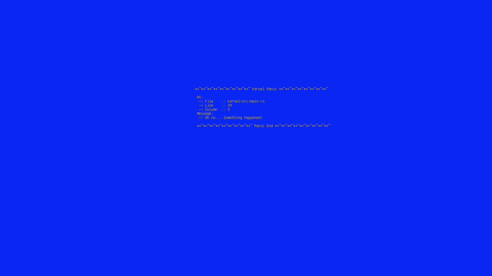
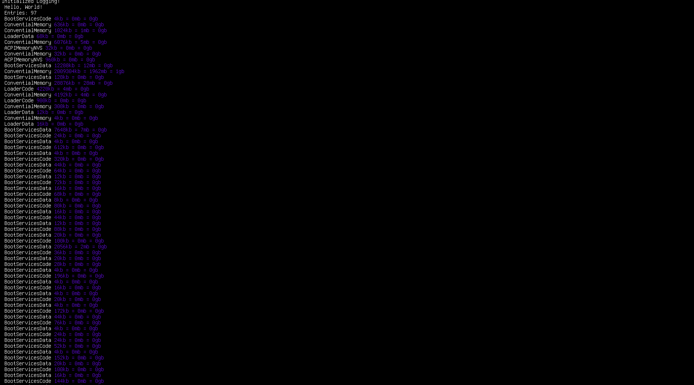

# Esque
A modern kernel featuring executables in WebAssembly as well as ELF - Uniting Past and Present

## Screenshots

A Blue Screen of Death in Esque (Kernel Panic)


A simple dump of the memory map


## Building

Run
```
make build
```
Then, run
```
make run
```
to run the OS using QEMU.

To clean, use
```
make clean
```

## About Unsafe
While it is true that an operating system without unsafe code is impossible,
I tried to limit it in here. At any point, 
```
make unsafe-counter
```
may be invoked which will display information about the unsafe-ness of the code.
At the time of writing, the following output is produced:
```
A total of 52 occurences have been found (1641 LOC, 0 Percent)
```

## What is an Exokernel

## Features

### Guards
Each aspect of the operating system is guarded by a fierce guard. For example, the framebuffer is guarded
by the FramebufferGuard.

### Capability-Based Applications
While Exokernels are based on the idea of trusting applications, this is not 100% neccessary. This is why all Applications have a set
of capabilities. Those permissions must be in the ELF file of the application.
If no capabilities are found in the ELF, a default set of capabilities is given
to the application. Those should suffice to run any *nix application.